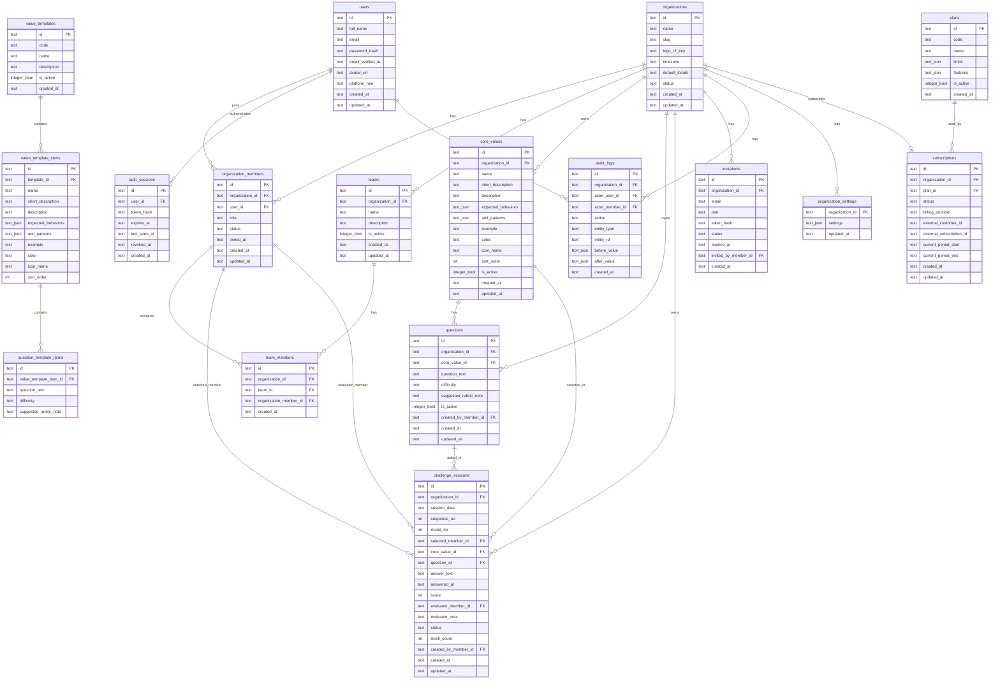

# ValueLoop SaaS App Spec

**Document Type:** PRD + ERD + Permission & Role Matrix + Technical Design Document + Design System  
**Product Name:** ValueLoop  
**Version:** 1.0 MVP SaaS  
**Primary Goal:** Build a multi-tenant SaaS app that helps organizations turn their core values into daily work habits through challenges, questions, answers, scoring, leaderboards, and insights.

---

## 0. Executive Summary

ValueLoop is a B2B SaaS platform for organizations that want to activate their internal core values in daily routines.

Instead of hardcoding one company's 5 Values, ValueLoop lets every organization define its own values, examples, behaviors, question bank, scoring rubric, members, teams, and challenge rhythm.

### Positioning

> ValueLoop helps organizations turn core values into daily habits through structured challenges, scoring, leaderboards, and culture insights.

### Core Loop

```text
Define Core Values
  ↓
Create Questions
  ↓
Run Daily Challenge
  ↓
Member Answers
  ↓
Facilitator Scores
  ↓
Leaderboard & Insights Update
  ↓
Repeat
```

### MVP Principle

Keep the MVP focused:

- Multi-tenant organization support.
- Custom core values per organization.
- Manual scoring 0–10.
- Daily challenge randomizer.
- Leaderboard.
- History.
- Basic insights.
- Role-based access control.

Do not include AI scoring, gamification, Slack integration, mobile native app, or complex HR review in MVP.

---

# 1. Product Requirement Document / PRD

## 1.1 Product Name

**ValueLoop**

## 1.2 Product Description

ValueLoop is a SaaS web app that enables organizations to manage, educate, and measure the practice of their core values through recurring team challenges.

Each organization can define its own values, for example:

- Integrity
- Ownership
- Customer Obsession
- Innovation
- Collaboration

Or:

- Good Product
- Good Attitude
- Good Service
- Good Teamwork
- Good Delivery

The system will randomly select a member, a core value, and a related question. The selected member answers, then a facilitator gives a score from 0 to 10 based on answer quality.

## 1.3 Problem Statement

Organizations often publish core values but fail to operationalize them into daily habits.

Common problems:

- Core values are only shown in onboarding slides or posters.
- Employees know the words but do not understand practical behavior.
- There is no lightweight ritual to reinforce values.
- Leaders cannot see whether people understand the values.
- Culture initiatives are often not measurable.
- Team meetings lack structured culture-building activities.

## 1.4 Goals

ValueLoop aims to:

1. Help organizations define and manage their own core values.
2. Convert abstract values into daily practical questions.
3. Make team meetings more intentional and culture-driven.
4. Measure understanding through answer scoring.
5. Track participation and improvement over time.
6. Provide lightweight culture insights for leaders.

## 1.5 Non-Goals for MVP

The following are explicitly not part of MVP:

- AI auto-scoring.
- Sentiment analysis.
- Complex competency mapping.
- Performance review automation.
- Payroll or HRIS integration.
- Slack, Teams, or WhatsApp integration.
- Native mobile app.
- Badge system and advanced gamification.
- Public marketplace for question templates.
- Enterprise SSO.

## 1.6 Target Customers

### Primary Customers

- Small to mid-sized companies.
- Agencies.
- Accounting, finance, tax, and service firms.
- SaaS companies.
- Operations-heavy teams.
- HR and People Ops teams.

### Secondary Customers

- Business consultants.
- Leadership coaches.
- Training providers.
- Internal culture committees.

## 1.7 User Personas

### Platform Admin

Internal ValueLoop operator. Manages SaaS-level data, plans, organizations, and system health.

### Organization Owner

Person who owns an organization account. Usually founder, director, HR lead, or operations manager.

### Organization Admin

Manages members, teams, core values, questions, and reports.

### Facilitator

Runs daily challenge in meetings, records answers, and submits scores.

### Member

Participates in challenge, answers questions, and views own history and leaderboard.

### Viewer

Can view dashboard, leaderboard, history, and reports, but cannot change operational data.

## 1.8 SaaS Tenant Model

ValueLoop must support multiple organizations.

Rules:

- One user can belong to multiple organizations.
- Each organization has isolated data.
- Every tenant-owned record must include `organization_id`.
- Users switch organization from the app header.
- Permissions are scoped per organization.
- Platform-level roles are separate from organization-level roles.
- Organization data must never leak to another organization.

## 1.9 Core Functional Requirements

## FR-001 Public Landing Page

ValueLoop should have a simple public landing page.

Content:

- Product headline.
- Product benefits.
- How it works.
- Call to action: `Create Organization` or `Sign In`.

Acceptance Criteria:

- Public users can view landing page.
- Logged-in users are redirected to dashboard.
- Public page does not expose tenant data.

---

## FR-002 Authentication

Users must be able to sign up, sign in, and sign out.

Recommended MVP:

- Email/password auth implemented in Astro Actions.
- User and session source of truth in Cloudflare D1.
- Session cache, login throttling, and one-time tokens in Cloudflare KV.
- Cloudflare Turnstile optional for signup/login abuse protection.
- Magic link and OAuth are not part of MVP unless a future external email/OAuth provider is intentionally added.

Acceptance Criteria:

- User can create account.
- User can sign in.
- User can sign out.
- Unauthenticated users cannot access app dashboard.
- Authenticated users without organization are redirected to onboarding.

---

## FR-003 Organization Onboarding

A new user can create an organization.

Onboarding steps:

1. Create account.
2. Create organization.
3. Choose template or start blank.
4. Invite members.
5. Create first challenge.

Acceptance Criteria:

- User can create organization with name and slug.
- Creator becomes `owner`.
- Organization gets default settings.
- User can choose a core value template or start blank.
- Organization slug must be unique.

---

## FR-004 Organization Switcher

Users who belong to multiple organizations can switch context.

Acceptance Criteria:

- Header shows current organization.
- User can switch to another organization where they are active member.
- All queries and actions use current organization context.
- If user has no access to organization, return unauthorized.

---

## FR-005 Manage Organization Settings

Owner and Admin can manage organization settings.

Fields:

- Organization name
- Slug
- Logo
- Timezone
- Default language
- Challenge frequency
- Question cooldown days
- Allow multiple challenges per day
- Active/inactive status

Acceptance Criteria:

- Owner can update billing-relevant settings.
- Admin can update non-billing settings.
- Slug update must validate uniqueness.
- Settings changes are logged in audit log.

---

## FR-006 Manage Members

Owner/Admin can invite and manage members.

Fields:

- Full name
- Email
- Role
- Team
- Active status

Acceptance Criteria:

- Owner/Admin can invite member by email.
- Invited user receives invitation link or pending invite record.
- Owner/Admin can change role.
- Owner/Admin can deactivate member.
- Deactivated member is excluded from random challenge selection.
- Member history remains available after deactivation.

---

## FR-007 Manage Teams

Organization can group members into teams/departments.

Fields:

- Team name
- Description
- Active status

Acceptance Criteria:

- Owner/Admin can create, update, deactivate teams.
- Member can belong to one or more teams.
- Leaderboard and history can be filtered by team.

---

## FR-008 Manage Core Values

Each organization can define its own core values.

Fields:

- Name
- Short description
- Full description
- Expected behaviors
- Anti-patterns
- Example
- Color
- Icon
- Sort order
- Active status

Acceptance Criteria:

- Owner/Admin can create, update, deactivate core values.
- Core values are tenant-specific.
- There is no hardcoded limit of 5 values.
- Minimum recommended active values: 1.
- Inactive values do not appear in new challenges.
- Existing history remains valid if a value is deactivated.

---

## FR-009 Core Value Templates

ValueLoop provides optional templates to speed up setup.

Examples:

- 5 Good Values template
- Leadership Values template
- Service Team template
- Startup Culture template

Acceptance Criteria:

- User can select template during onboarding.
- Template creates core values and starter questions inside organization.
- Templates are copied, not linked.
- Organization can edit copied values after setup.

---

## FR-010 Manage Question Bank

Questions are connected to core values.

Fields:

- Core value
- Question text
- Difficulty: easy, medium, hard
- Suggested rubric note
- Active status

Acceptance Criteria:

- Owner/Admin can create, update, deactivate questions.
- Question must belong to one core value.
- Facilitator can view question bank.
- Inactive questions are excluded from random selection.
- Questions are tenant-specific.

---

## FR-011 Start Challenge

Facilitator/Admin/Owner can start a challenge.

System randomly selects:

1. Member
2. Core value
3. Question related to selected core value

Acceptance Criteria:

- Random result is saved to database.
- Refreshing the page does not change result.
- Challenge date uses organization timezone.
- System excludes inactive members.
- System excludes inactive values.
- System excludes inactive questions.
- If there is already an open challenge for the date and organization, return existing challenge unless multiple daily challenges are enabled.

---

## FR-012 Fair Member Randomization

The system should distribute selection fairly.

Rule:

- Select active members who have not been selected in the current round.
- If all active members have been selected, increment round number.
- Select random member from candidates.

Acceptance Criteria:

- Same member should not be prioritized repeatedly.
- Round number is stored in challenge session.
- Deactivated members are ignored.
- Re-activated members are eligible from current round onward.

---

## FR-013 Core Value Randomization

The system selects one active core value randomly.

Optional future weighting:

- Weight by underrepresented values.
- Weight by company focus of the week.
- Weight by team.

MVP Rule:

- Random active value from current organization.

Acceptance Criteria:

- Selected value belongs to current organization.
- Inactive values are excluded.

---

## FR-014 Question Randomization

System selects one active question under selected core value.

MVP Rule:

- Avoid questions used in the last N days, where N comes from organization setting.
- If no alternative exists, reuse older question.

Acceptance Criteria:

- Question must match selected core value.
- Question must belong to current organization.
- Random result must be persistent.

---

## FR-015 Reroll Challenge

Facilitator/Admin/Owner can reroll if selected member is absent or selection is invalid.

Acceptance Criteria:

- Reroll is only allowed before answer is submitted.
- Reroll reason is optional but recommended.
- Reroll count is tracked.
- Reroll event is logged.
- Scored sessions cannot be rerolled.

---

## FR-016 Submit Answer

Facilitator records selected member's answer.

Fields:

- Answer text
- Answered at

Acceptance Criteria:

- Answer cannot be empty.
- Answer can only be submitted for open challenge.
- Status changes from `open` to `answered`.
- Answer is associated with selected member.
- Audit log is created.

---

## FR-017 Submit Score

Facilitator/Admin/Owner scores the answer.

Fields:

- Score 0–10
- Evaluator note

Acceptance Criteria:

- Score must be integer 0–10.
- Scorer must have `challenge.score` permission.
- Member cannot score their own answer unless they are owner/admin and self-score is allowed by organization setting.
- Status changes to `scored`.
- Leaderboard updates automatically through query/view.
- Audit log is created.

---

## FR-018 Leaderboard

Leaderboard ranks members based on scored sessions.

Metrics:

- Total points
- Total answered
- Average score
- Highest score
- Last participation date

Acceptance Criteria:

- Leaderboard is scoped to current organization.
- Can filter by date range and team.
- Default sorting: total points descending, average score descending, total answered descending.
- Inactive members can be hidden or shown.
- Member can see leaderboard if permitted.

---

## FR-019 History

History shows challenge records.

Fields:

- Date
- Member
- Team
- Core value
- Question
- Answer
- Score
- Evaluator
- Evaluator note
- Status

Acceptance Criteria:

- Owner/Admin/Facilitator/Viewer can view all organization history.
- Member can view own history.
- Filters: date range, member, team, value, status.
- History is tenant-scoped.

---

## FR-020 Dashboard

Dashboard summarizes organization activity.

Widgets:

- Today challenge
- Total active members
- Total challenges this month
- Average score this month
- Top 5 leaderboard
- Value distribution
- Participation rate

Acceptance Criteria:

- Dashboard data is scoped to current organization.
- Member sees limited dashboard.
- Admin/Owner sees full dashboard.
- Empty state is shown if organization has no values/questions/members.

---

## FR-021 Insights

MVP insights should be basic and query-based.

Insights:

- Participation rate
- Average score by value
- Average score by team
- Most frequently asked values
- Members not yet selected this round

Acceptance Criteria:

- Insights are accessible to Owner/Admin/Viewer.
- Data is scoped to organization.
- Filters by date range and team.

---

## FR-022 Audit Log

Important changes must be logged.

Events:

- Organization created/updated
- Member invited/updated/deactivated
- Role changed
- Core value created/updated/deactivated
- Question created/updated/deactivated
- Challenge started/rerolled/answered/scored/cancelled
- Settings updated

Acceptance Criteria:

- Audit log includes actor, organization, action, entity, before value, after value, timestamp.
- Audit log is read-only from UI.
- Owner/Admin can view organization audit log.
- Platform Admin can view all audit logs.

---

## FR-023 Billing and Plan Limits

Billing can be MVP-lite or Phase 2.

Recommended MVP:

- Create plan and subscription tables.
- Implement plan limit checks in code.
- Payment integration can be added later.

Plan limits examples:

- Max members
- Max active core values
- Max challenges per month
- Insights access
- Export access
- AI scoring access in future

Acceptance Criteria:

- Organization has assigned plan.
- App can check feature access.
- Owner can see plan page.
- Payment provider integration can be stubbed in MVP.

---

## FR-024 Data Export

Owner/Admin/Viewer can export reports.

MVP Export:

- CSV history export.
- CSV leaderboard export.

Acceptance Criteria:

- Export respects permission.
- Export is scoped to organization.
- Export supports date range filter.

---

## 1.10 Non-Functional Requirements

### Security

- Enforce authentication for all app routes.
- Enforce server-side permission checks.
- Enforce tenant isolation in all service methods.
- Every tenant-owned query must filter by `organization_id`.
- Role checks in UI are not enough.
- Audit critical actions.
- Never expose data across organizations.

### Performance

- Dashboard query should load within 2 seconds for normal organization data.
- Leaderboard query should load within 1 second for small/mid-sized tenant.
- Add indexes on `organization_id`, date, member, value, and status.
- Use pagination for history and audit log.

### Reliability

- Challenge random result must persist.
- Refresh must not rerandomize.
- Scored session should be immutable by facilitator.
- Owner/Admin edits on scored session must be audited.
- Database constraints should protect invalid scores and status.

### Usability

- Challenge page must be readable during meetings.
- Main CTA must be clear.
- Empty states must guide setup.
- Organization switcher must be obvious.
- Mobile responsive, but desktop/tablet meeting display is priority.

### Scalability

- Data model must support many organizations.
- Organization-level indexes required.
- Avoid global queries without pagination.
- Design all tenant-owned tables with `organization_id`.

---

# 2. SaaS Data Model & ERD

## 2.1 Multi-Tenant Data Rules

All tenant-owned tables must include:

```text
organization_id text not null
```

Tenant-owned tables:

- organization_members
- teams
- team_members
- core_values
- questions
- challenge_sessions
- audit_logs
- organization_settings
- invitations

Global/platform tables:

- users
- organizations
- plans
- subscriptions
- value_templates
- value_template_items
- question_template_items

## 2.2 Mermaid ERD



---

# 3. Database Schema

Assumption: Cloudflare D1 with SQLite-compatible SQL. Authentication is app-managed through Astro Actions/API routes, D1 user/session tables, and KV-backed session/token cache.

## 3.1 Cloudflare D1 Notes

- D1 is the source of truth for relational data.
- IDs are `text` UUID strings generated in application code with `crypto.randomUUID()`.
- Timestamps are stored as UTC ISO strings or SQLite `current_timestamp` text values.
- JSON fields are stored as `text` and protected with `json_valid(...)` checks.
- Boolean values are stored as `integer` with `0` or `1`.
- KV handles cache, session cache, rate limits, nonce/token storage, and short-lived coordination data. Do not use KV as the source of truth for tenant data.
- R2 stores logos and exported files. D1 stores object keys such as `logo_r2_key`, not binary files.

## 3.2 Core Tables

```sql
pragma foreign_keys = on;

create table users (
    id text primary key,
    full_name text not null,
    email text not null unique,
    password_hash text,
    email_verified_at text,
    avatar_url text,
    platform_role text not null default 'none'
        check (platform_role in ('none', 'platform_admin')),
    created_at text not null default current_timestamp,
    updated_at text not null default current_timestamp
);

create table auth_sessions (
    id text primary key,
    user_id text not null references users(id) on delete cascade,
    token_hash text not null unique,
    expires_at text not null,
    last_seen_at text,
    revoked_at text,
    created_at text not null default current_timestamp
);

create table organizations (
    id text primary key,
    name text not null,
    slug text not null unique,
    logo_r2_key text,
    timezone text not null default 'Asia/Jakarta',
    default_locale text not null default 'id',
    status text not null default 'active'
        check (status in ('active', 'suspended', 'cancelled')),
    created_at text not null default current_timestamp,
    updated_at text not null default current_timestamp
);

create table organization_members (
    id text primary key,
    organization_id text not null references organizations(id) on delete cascade,
    user_id text not null references users(id) on delete cascade,
    role text not null
        check (role in ('owner', 'admin', 'facilitator', 'member', 'viewer')),
    status text not null default 'active'
        check (status in ('active', 'invited', 'inactive')),
    joined_at text,
    created_at text not null default current_timestamp,
    updated_at text not null default current_timestamp,
    unique (organization_id, user_id)
);

create table teams (
    id text primary key,
    organization_id text not null references organizations(id) on delete cascade,
    name text not null,
    description text,
    is_active integer not null default 1 check (is_active in (0, 1)),
    created_at text not null default current_timestamp,
    updated_at text not null default current_timestamp,
    unique (organization_id, name)
);

create table team_members (
    id text primary key,
    organization_id text not null references organizations(id) on delete cascade,
    team_id text not null references teams(id) on delete cascade,
    organization_member_id text not null references organization_members(id) on delete cascade,
    created_at text not null default current_timestamp,
    unique (team_id, organization_member_id)
);

create table core_values (
    id text primary key,
    organization_id text not null references organizations(id) on delete cascade,
    name text not null,
    short_description text not null,
    description text,
    expected_behaviors text not null default '[]' check (json_valid(expected_behaviors)),
    anti_patterns text not null default '[]' check (json_valid(anti_patterns)),
    example text,
    color text not null default '#2563EB',
    icon_name text not null default 'star',
    sort_order integer not null default 0,
    is_active integer not null default 1 check (is_active in (0, 1)),
    created_at text not null default current_timestamp,
    updated_at text not null default current_timestamp
);

create table questions (
    id text primary key,
    organization_id text not null references organizations(id) on delete cascade,
    core_value_id text not null references core_values(id) on delete cascade,
    question_text text not null,
    difficulty text not null default 'easy'
        check (difficulty in ('easy', 'medium', 'hard')),
    suggested_rubric_note text,
    is_active integer not null default 1 check (is_active in (0, 1)),
    created_by_member_id text references organization_members(id) on delete set null,
    created_at text not null default current_timestamp,
    updated_at text not null default current_timestamp
);

create table challenge_sessions (
    id text primary key,
    organization_id text not null references organizations(id) on delete cascade,
    session_date text not null,
    sequence_no integer not null default 1,
    round_no integer not null default 1,
    selected_member_id text not null references organization_members(id) on delete restrict,
    core_value_id text not null references core_values(id) on delete restrict,
    question_id text not null references questions(id) on delete restrict,
    answer_text text,
    answered_at text,
    score integer check (score >= 0 and score <= 10),
    evaluator_member_id text references organization_members(id) on delete set null,
    evaluator_note text,
    status text not null default 'open'
        check (status in ('open', 'answered', 'scored', 'cancelled')),
    reroll_count integer not null default 0,
    created_by_member_id text references organization_members(id) on delete set null,
    created_at text not null default current_timestamp,
    updated_at text not null default current_timestamp,
    unique (organization_id, session_date, sequence_no)
);
```

## 3.3 SaaS Support Tables

```sql
create table invitations (
    id text primary key,
    organization_id text not null references organizations(id) on delete cascade,
    email text not null,
    role text not null
        check (role in ('owner', 'admin', 'facilitator', 'member', 'viewer')),
    token_hash text not null unique,
    status text not null default 'pending'
        check (status in ('pending', 'accepted', 'expired', 'revoked')),
    expires_at text not null,
    invited_by_member_id text references organization_members(id) on delete set null,
    created_at text not null default current_timestamp
);

create table audit_logs (
    id text primary key,
    organization_id text references organizations(id) on delete cascade,
    actor_user_id text references users(id) on delete set null,
    actor_member_id text references organization_members(id) on delete set null,
    action text not null,
    entity_type text not null,
    entity_id text,
    before_value text check (before_value is null or json_valid(before_value)),
    after_value text check (after_value is null or json_valid(after_value)),
    created_at text not null default current_timestamp
);

create table organization_settings (
    organization_id text primary key references organizations(id) on delete cascade,
    settings text not null default '{"challengeFrequency":"daily","questionCooldownDays":14,"allowMultipleChallengesPerDay":false,"allowSelfScoring":false,"defaultScoreRubric":[{"min":0,"max":2,"label":"Perlu banyak perbaikan"},{"min":3,"max":4,"label":"Masih kurang"},{"min":5,"max":6,"label":"Cukup"},{"min":7,"max":8,"label":"Baik"},{"min":9,"max":10,"label":"Sangat baik"}]}'
        check (json_valid(settings)),
    updated_at text not null default current_timestamp
);

create table plans (
    id text primary key,
    code text not null unique,
    name text not null,
    limits text not null default '{}' check (json_valid(limits)),
    features text not null default '{}' check (json_valid(features)),
    is_active integer not null default 1 check (is_active in (0, 1)),
    created_at text not null default current_timestamp
);

create table subscriptions (
    id text primary key,
    organization_id text not null unique references organizations(id) on delete cascade,
    plan_id text not null references plans(id) on delete restrict,
    status text not null default 'trialing'
        check (status in ('trialing', 'active', 'past_due', 'cancelled')),
    billing_provider text,
    external_customer_id text,
    external_subscription_id text,
    current_period_start text,
    current_period_end text,
    created_at text not null default current_timestamp,
    updated_at text not null default current_timestamp
);
```

## 3.4 Template Tables

```sql
create table value_templates (
    id text primary key,
    code text not null unique,
    name text not null,
    description text,
    is_active integer not null default 1 check (is_active in (0, 1)),
    created_at text not null default current_timestamp
);

create table value_template_items (
    id text primary key,
    template_id text not null references value_templates(id) on delete cascade,
    name text not null,
    short_description text not null,
    description text,
    expected_behaviors text not null default '[]' check (json_valid(expected_behaviors)),
    anti_patterns text not null default '[]' check (json_valid(anti_patterns)),
    example text,
    color text not null default '#2563EB',
    icon_name text not null default 'star',
    sort_order integer not null default 0
);

create table question_template_items (
    id text primary key,
    value_template_item_id text not null references value_template_items(id) on delete cascade,
    question_text text not null,
    difficulty text not null default 'easy'
        check (difficulty in ('easy', 'medium', 'hard')),
    suggested_rubric_note text
);
```

## 3.5 Indexes

```sql
create index idx_auth_sessions_user on auth_sessions(user_id);
create index idx_auth_sessions_expires on auth_sessions(expires_at);

create index idx_org_members_org on organization_members(organization_id);
create index idx_org_members_user on organization_members(user_id);
create index idx_org_members_role on organization_members(role);
create index idx_org_members_status on organization_members(status);

create index idx_teams_org on teams(organization_id);
create index idx_team_members_org on team_members(organization_id);
create index idx_team_members_team on team_members(team_id);
create index idx_team_members_member on team_members(organization_member_id);

create index idx_core_values_org on core_values(organization_id);
create index idx_core_values_active on core_values(organization_id, is_active);

create index idx_questions_org on questions(organization_id);
create index idx_questions_value on questions(core_value_id);
create index idx_questions_active on questions(organization_id, core_value_id, is_active);

create index idx_sessions_org_date on challenge_sessions(organization_id, session_date);
create index idx_sessions_org_member on challenge_sessions(organization_id, selected_member_id);
create index idx_sessions_org_value on challenge_sessions(organization_id, core_value_id);
create index idx_sessions_org_status on challenge_sessions(organization_id, status);
create index idx_sessions_round on challenge_sessions(organization_id, round_no);

create index idx_audit_org_created on audit_logs(organization_id, created_at);
create index idx_audit_actor on audit_logs(actor_user_id);
```

## 3.6 Leaderboard View

```sql
create or replace view leaderboard_view as
select
    om.organization_id,
    om.id as organization_member_id,
    u.id as user_id,
    u.full_name,
    u.email,
    om.role,
    om.status,
    coalesce(sum(case when cs.status = 'scored' then coalesce(cs.score, 0) else 0 end), 0) as total_points,
    count(case when cs.status = 'scored' then 1 end) as total_answered,
    round(avg(case when cs.status = 'scored' then cs.score end), 2) as average_score,
    max(case when cs.status = 'scored' then cs.score end) as highest_score,
    max(case when cs.status = 'scored' then cs.session_date end) as last_participation_date
from organization_members om
join users u on u.id = om.user_id
left join challenge_sessions cs
    on cs.selected_member_id = om.id
    and cs.organization_id = om.organization_id
    and cs.status = 'scored'
where om.status in ('active', 'inactive')
group by
    om.organization_id,
    om.id,
    u.id,
    u.full_name,
    u.email,
    om.role,
    om.status;
```

---

# 4. Permission & Role Matrix

## 4.1 Role Types

There are two role scopes.

### Platform Role

Used by ValueLoop internal operators.

| Platform Role | Description |
|---|---|
| `platform_admin` | Can access platform admin area and manage organizations/plans. |
| `none` | Normal user. |

### Organization Role

Scoped per organization.

| Organization Role | Description |
|---|---|
| `owner` | Full access to organization, billing, members, settings. |
| `admin` | Manages operational data except billing ownership. |
| `facilitator` | Runs challenge, records answer, submits score. |
| `member` | Participates and views allowed data. |
| `viewer` | Read-only access to dashboard, leaderboard, history, insights. |

## 4.2 Organization Permission Matrix

| Module / Action | Owner | Admin | Facilitator | Member | Viewer |
|---|---:|---:|---:|---:|---:|
| View Dashboard | Yes | Yes | Yes | Limited | Yes |
| View Core Values | Yes | Yes | Yes | Yes | Yes |
| Manage Core Values | Yes | Yes | No | No | No |
| View Question Bank | Yes | Yes | Yes | No | Yes |
| Manage Questions | Yes | Yes | No | No | No |
| View Members | Yes | Yes | Yes | Limited | Yes |
| Invite Members | Yes | Yes | No | No | No |
| Manage Member Roles | Yes | Yes | No | No | No |
| Transfer Ownership | Yes | No | No | No | No |
| Manage Teams | Yes | Yes | No | No | No |
| Start Challenge | Yes | Yes | Yes | No | No |
| Reroll Challenge | Yes | Yes | Yes | No | No |
| Submit Answer | Yes | Yes | Yes | No | No |
| Submit Score | Yes | Yes | Yes | No | No |
| Edit Scored Session | Yes | Yes | No | No | No |
| Cancel Session | Yes | Yes | No | No | No |
| View All History | Yes | Yes | Yes | No | Yes |
| View Own History | Yes | Yes | Yes | Yes | Yes |
| View Leaderboard | Yes | Yes | Yes | Yes | Yes |
| View Insights | Yes | Yes | Yes | No | Yes |
| Export Reports | Yes | Yes | Yes | No | Yes |
| View Audit Log | Yes | Yes | No | No | No |
| Manage Org Settings | Yes | Yes | No | No | No |
| Manage Billing | Yes | No | No | No | No |
| Delete Organization | Yes | No | No | No | No |

## 4.3 Platform Permission Matrix

| Platform Action | Platform Admin |
|---|---:|
| View all organizations | Yes |
| Suspend organization | Yes |
| Manage plans | Yes |
| View platform audit logs | Yes |
| Access organization data for support | Yes, audited |
| Modify organization billing status | Yes |

## 4.4 Permission Constants

```ts
export const PERMISSIONS = {
  DASHBOARD_VIEW: 'dashboard.view',

  CORE_VALUES_VIEW: 'core_values.view',
  CORE_VALUES_MANAGE: 'core_values.manage',

  QUESTIONS_VIEW: 'questions.view',
  QUESTIONS_MANAGE: 'questions.manage',

  MEMBERS_VIEW: 'members.view',
  MEMBERS_INVITE: 'members.invite',
  MEMBERS_MANAGE: 'members.manage',
  MEMBERS_MANAGE_ROLES: 'members.manage_roles',

  TEAMS_VIEW: 'teams.view',
  TEAMS_MANAGE: 'teams.manage',

  CHALLENGE_START: 'challenge.start',
  CHALLENGE_REROLL: 'challenge.reroll',
  CHALLENGE_ANSWER: 'challenge.answer',
  CHALLENGE_SCORE: 'challenge.score',
  CHALLENGE_EDIT_SCORED: 'challenge.edit_scored',
  CHALLENGE_CANCEL: 'challenge.cancel',

  HISTORY_VIEW_ALL: 'history.view_all',
  HISTORY_VIEW_OWN: 'history.view_own',

  LEADERBOARD_VIEW: 'leaderboard.view',

  INSIGHTS_VIEW: 'insights.view',

  REPORT_EXPORT: 'report.export',

  AUDIT_VIEW: 'audit.view',

  ORG_SETTINGS_MANAGE: 'org_settings.manage',
  BILLING_MANAGE: 'billing.manage',
  ORG_DELETE: 'organization.delete',
} as const;
```

## 4.5 Role Permission Mapping

```ts
export const ROLE_PERMISSIONS = {
  owner: Object.values(PERMISSIONS),

  admin: [
    PERMISSIONS.DASHBOARD_VIEW,
    PERMISSIONS.CORE_VALUES_VIEW,
    PERMISSIONS.CORE_VALUES_MANAGE,
    PERMISSIONS.QUESTIONS_VIEW,
    PERMISSIONS.QUESTIONS_MANAGE,
    PERMISSIONS.MEMBERS_VIEW,
    PERMISSIONS.MEMBERS_INVITE,
    PERMISSIONS.MEMBERS_MANAGE,
    PERMISSIONS.MEMBERS_MANAGE_ROLES,
    PERMISSIONS.TEAMS_VIEW,
    PERMISSIONS.TEAMS_MANAGE,
    PERMISSIONS.CHALLENGE_START,
    PERMISSIONS.CHALLENGE_REROLL,
    PERMISSIONS.CHALLENGE_ANSWER,
    PERMISSIONS.CHALLENGE_SCORE,
    PERMISSIONS.CHALLENGE_EDIT_SCORED,
    PERMISSIONS.CHALLENGE_CANCEL,
    PERMISSIONS.HISTORY_VIEW_ALL,
    PERMISSIONS.HISTORY_VIEW_OWN,
    PERMISSIONS.LEADERBOARD_VIEW,
    PERMISSIONS.INSIGHTS_VIEW,
    PERMISSIONS.REPORT_EXPORT,
    PERMISSIONS.AUDIT_VIEW,
    PERMISSIONS.ORG_SETTINGS_MANAGE,
  ],

  facilitator: [
    PERMISSIONS.DASHBOARD_VIEW,
    PERMISSIONS.CORE_VALUES_VIEW,
    PERMISSIONS.QUESTIONS_VIEW,
    PERMISSIONS.MEMBERS_VIEW,
    PERMISSIONS.CHALLENGE_START,
    PERMISSIONS.CHALLENGE_REROLL,
    PERMISSIONS.CHALLENGE_ANSWER,
    PERMISSIONS.CHALLENGE_SCORE,
    PERMISSIONS.HISTORY_VIEW_ALL,
    PERMISSIONS.HISTORY_VIEW_OWN,
    PERMISSIONS.LEADERBOARD_VIEW,
    PERMISSIONS.INSIGHTS_VIEW,
    PERMISSIONS.REPORT_EXPORT,
  ],

  member: [
    PERMISSIONS.DASHBOARD_VIEW,
    PERMISSIONS.CORE_VALUES_VIEW,
    PERMISSIONS.HISTORY_VIEW_OWN,
    PERMISSIONS.LEADERBOARD_VIEW,
  ],

  viewer: [
    PERMISSIONS.DASHBOARD_VIEW,
    PERMISSIONS.CORE_VALUES_VIEW,
    PERMISSIONS.QUESTIONS_VIEW,
    PERMISSIONS.MEMBERS_VIEW,
    PERMISSIONS.HISTORY_VIEW_ALL,
    PERMISSIONS.HISTORY_VIEW_OWN,
    PERMISSIONS.LEADERBOARD_VIEW,
    PERMISSIONS.INSIGHTS_VIEW,
    PERMISSIONS.REPORT_EXPORT,
  ],
} as const;
```

---

# 5. Technical Design Document / TDD

## 5.1 Recommended Stack

### Frontend

- Astro
- Astro Cloudflare adapter (`@astrojs/cloudflare`)
- TypeScript
- Tailwind CSS
- Astro component-based UI
- Client islands only for interactive widgets
- Zod validation

### Backend

- Astro Actions or API routes
- Cloudflare Workers runtime
- App-managed authentication backed by Cloudflare D1 and KV
- Cloudflare D1 for relational data
- Cloudflare KV for key-value cache, session cache, rate limits, and ephemeral tokens
- Cloudflare R2 for object storage
- Service layer for business logic

### Deployment

- Cloudflare Workers for web app and server runtime
- Wrangler for local bindings, D1 migrations, and deployment configuration
- Cloudflare D1 for primary database
- Cloudflare KV for key-value storage
- Cloudflare R2 for organization logos and exported files
- Stripe integration in Phase 2

### Testing

- Unit tests for services and permission rules.
- Integration tests for challenge flow.
- E2E tests for onboarding and challenge run.

---

## 5.2 Architecture

```text
Browser
  ↓
Cloudflare Workers
  ↓
Astro app
  ↓
Astro middleware
  ↓
Auth Resolver
  ↓
Organization Context Resolver
  ↓
Permission Guard
  ↓
Astro Actions / API routes
  ↓
Service Layer
  ↓
Repository Layer
  ↓
Cloudflare D1

Side bindings:
- Cloudflare KV for cache, sessions, rate limits, nonce/token storage
- Cloudflare R2 for logo and report file storage
```

## 5.3 Organization Context

Every authenticated app route must resolve:

```ts
type RequestContext = {
  userId: string;
  organizationId: string;
  organizationMemberId: string;
  organizationRole: 'owner' | 'admin' | 'facilitator' | 'member' | 'viewer';
  platformRole: 'none' | 'platform_admin';
  permissions: string[];
};
```

Organization can be resolved from:

1. URL path: `/app/[orgSlug]/...`
2. Header/cookie storing last selected organization.
3. Explicit organization selector.

Recommended route model:

```text
/app/[orgSlug]/dashboard
/app/[orgSlug]/values
/app/[orgSlug]/challenge
/app/[orgSlug]/leaderboard
/app/[orgSlug]/history
/app/[orgSlug]/insights
/app/[orgSlug]/settings
```

---

## 5.4 Folder Structure

```text
astro.config.mjs
wrangler.jsonc

migrations/
  0001_initial.sql

src/
  pages/
    index.astro
    login.astro
    signup.astro
    onboarding.astro

    app/
      [orgSlug]/
        dashboard.astro
        values.astro
        challenge.astro
        leaderboard.astro
        history.astro
        insights.astro
        members.astro
        teams.astro
        questions.astro
        settings.astro
        billing.astro

    platform/
      organizations.astro
      plans.astro

    api/
      health.ts

  actions/
    index.ts

  middleware.ts

  components/
    layout/
      app-shell.astro
      app-sidebar.astro
      app-header.astro
      organization-switcher.astro

    onboarding/
      create-organization-form.astro
      template-picker.astro
      invite-members-form.astro

    values/
      core-value-card.astro
      core-value-form.astro
      core-value-grid.astro

    questions/
      question-table.astro
      question-form.astro

    challenge/
      challenge-panel.astro
      selected-member-card.astro
      selected-value-card.astro
      question-card.astro
      answer-form.astro
      score-form.astro
      score-rubric.astro
      reroll-dialog.astro

    leaderboard/
      leaderboard-table.astro
      top-three-cards.astro

    history/
      history-filter.astro
      history-table.astro
      history-detail-dialog.astro

    insights/
      metric-card.astro
      value-score-chart.astro
      participation-chart.astro

    members/
      members-table.astro
      invite-member-dialog.astro
      member-role-select.astro

    ui/
      button.astro
      card.astro
      badge.astro
      input.astro
      textarea.astro
      select.astro
      dialog.astro
      table.astro
      toast.astro
      dropdown-menu.astro

  lib/
    auth/
      get-current-user.ts
      require-auth.ts
      session.ts
      password.ts

    context/
      get-request-context.ts
      require-org-context.ts

    permissions/
      permissions.ts
      require-permission.ts

    db/
      d1.ts
      queries.ts

    cloudflare/
      bindings.ts
      kv.ts
      r2.ts

    services/
      organization-service.ts
      onboarding-service.ts
      member-service.ts
      team-service.ts
      core-value-service.ts
      question-service.ts
      challenge-service.ts
      leaderboard-service.ts
      history-service.ts
      insight-service.ts
      audit-service.ts
      billing-service.ts

    validations/
      organization-schema.ts
      member-schema.ts
      team-schema.ts
      core-value-schema.ts
      question-schema.ts
      challenge-schema.ts

    utils/
      random.ts
      date.ts
      slug.ts
      format.ts

  types/
    database.ts
    app.ts
    permissions.ts
```

---

## 5.5 Route Map

| Route | Description | Access |
|---|---|---|
| `/` | Public landing page | Public |
| `/login` | Login page | Public |
| `/signup` | Signup page | Public |
| `/onboarding` | Create organization | Authenticated |
| `/app/[orgSlug]/dashboard` | Organization dashboard | Org members |
| `/app/[orgSlug]/values` | Core values management/view | Based on permission |
| `/app/[orgSlug]/challenge` | Run challenge | Owner/Admin/Facilitator |
| `/app/[orgSlug]/leaderboard` | Leaderboard | Org members |
| `/app/[orgSlug]/history` | Challenge history | Based on permission |
| `/app/[orgSlug]/insights` | Culture insights | Owner/Admin/Facilitator/Viewer |
| `/app/[orgSlug]/members` | Members management | Owner/Admin |
| `/app/[orgSlug]/teams` | Teams management | Owner/Admin |
| `/app/[orgSlug]/questions` | Question bank | Owner/Admin/Facilitator/Viewer |
| `/app/[orgSlug]/settings` | Organization settings | Owner/Admin |
| `/app/[orgSlug]/billing` | Billing | Owner |
| `/platform/organizations` | Platform organization management | Platform Admin |
| `/platform/plans` | Platform plan management | Platform Admin |

---

## 5.6 Astro Actions / API Contracts

## `createOrganization`

Input:

```ts
type CreateOrganizationInput = {
  name: string;
  slug: string;
  timezone: string;
  templateCode?: string;
};
```

Rules:

1. User must be authenticated.
2. Slug must be unique.
3. Create organization.
4. Create organization_settings.
5. Create owner membership.
6. Create subscription/trial plan.
7. If template selected, copy template values and questions.
8. Create audit log.

---

## `inviteMember`

Input:

```ts
type InviteMemberInput = {
  organizationId: string;
  email: string;
  role: 'admin' | 'facilitator' | 'member' | 'viewer';
  teamIds?: string[];
};
```

Rules:

- Requires `members.invite`.
- Cannot invite owner directly unless current user is owner.
- Check plan member limit.
- Create invitation.
- If user already exists, create pending or active membership depending invite acceptance flow.

---

## `createCoreValue`

Input:

```ts
type CreateCoreValueInput = {
  organizationId: string;
  name: string;
  shortDescription: string;
  description?: string;
  expectedBehaviors?: string[];
  antiPatterns?: string[];
  example?: string;
  color?: string;
  iconName?: string;
  sortOrder?: number;
};
```

Rules:

- Requires `core_values.manage`.
- Check plan max active values if active.
- Create tenant-scoped value.
- Audit action.

---

## `createQuestion`

Input:

```ts
type CreateQuestionInput = {
  organizationId: string;
  coreValueId: string;
  questionText: string;
  difficulty: 'easy' | 'medium' | 'hard';
  suggestedRubricNote?: string;
};
```

Rules:

- Requires `questions.manage`.
- `coreValueId` must belong to current organization.
- Audit action.

---

## `startChallenge`

Input:

```ts
type StartChallengeInput = {
  organizationId: string;
  sessionDate?: string;
};
```

Output:

```ts
type ChallengeSessionDto = {
  id: string;
  sessionDate: string;
  sequenceNo: number;
  roundNo: number;
  selectedMember: {
    id: string;
    fullName: string;
    email: string;
  };
  coreValue: {
    id: string;
    name: string;
    color: string;
    iconName: string;
  };
  question: {
    id: string;
    questionText: string;
    difficulty: string;
  };
  status: 'open' | 'answered' | 'scored' | 'cancelled';
};
```

Rules:

1. Requires `challenge.start`.
2. Resolve organization timezone.
3. Check active subscription or trial.
4. Check plan monthly challenge limit.
5. If `allowMultipleChallengesPerDay = false`, return existing open/answered/scored session for today.
6. Pick member using fair randomization.
7. Pick active core value.
8. Pick active question under value.
9. Create challenge session.
10. Audit action.

---

## `rerollChallenge`

Input:

```ts
type RerollChallengeInput = {
  organizationId: string;
  sessionId: string;
  reason?: string;
};
```

Rules:

- Requires `challenge.reroll`.
- Session must belong to organization.
- Session status must be `open`.
- Reroll selected member, value, and question.
- Increment `reroll_count`.
- Audit before/after.

---

## `submitAnswer`

Input:

```ts
type SubmitAnswerInput = {
  organizationId: string;
  sessionId: string;
  answerText: string;
};
```

Rules:

- Requires `challenge.answer`.
- Session must belong to organization.
- Status must be `open`.
- Answer text min length: 3.
- Update status to `answered`.

---

## `submitScore`

Input:

```ts
type SubmitScoreInput = {
  organizationId: string;
  sessionId: string;
  score: number;
  evaluatorNote?: string;
};
```

Rules:

- Requires `challenge.score`.
- Session must belong to organization.
- Status must be `answered`.
- Score integer 0–10.
- If selected member equals evaluator and `allowSelfScoring = false`, reject.
- Update status to `scored`.
- Audit action.

---

## `getLeaderboard`

Input:

```ts
type GetLeaderboardInput = {
  organizationId: string;
  teamId?: string;
  startDate?: string;
  endDate?: string;
  includeInactive?: boolean;
};
```

Rules:

- Requires `leaderboard.view`.
- Scope by organization.
- Use pagination for long leaderboard.

---

## `getHistory`

Input:

```ts
type GetHistoryInput = {
  organizationId: string;
  memberId?: string;
  coreValueId?: string;
  teamId?: string;
  status?: 'open' | 'answered' | 'scored' | 'cancelled';
  startDate?: string;
  endDate?: string;
  page?: number;
  pageSize?: number;
};
```

Rules:

- If user has `history.view_all`, return organization history.
- If user only has `history.view_own`, force `memberId = currentMemberId`.

---

## 5.7 Randomization Algorithms

## Fair Member Randomization

```ts
async function pickRandomMember(organizationId: string) {
  const activeMembers = await getActiveChallengeEligibleMembers(organizationId);

  if (activeMembers.length === 0) {
    throw new Error('Belum ada member aktif untuk dipilih.');
  }

  const currentRound = await getCurrentRoundNo(organizationId);

  const selectedMemberIds = await getSelectedMemberIdsByRound({
    organizationId,
    roundNo: currentRound,
  });

  let candidates = activeMembers.filter(
    member => !selectedMemberIds.includes(member.id)
  );

  let roundNo = currentRound;

  if (candidates.length === 0) {
    roundNo = currentRound + 1;
    candidates = activeMembers;
  }

  return {
    selectedMember: randomItem(candidates),
    roundNo,
  };
}
```

## Core Value Randomization

```ts
async function pickRandomCoreValue(organizationId: string) {
  const activeValues = await getActiveCoreValues(organizationId);

  if (activeValues.length === 0) {
    throw new Error('Belum ada core value aktif.');
  }

  return randomItem(activeValues);
}
```

## Question Randomization

```ts
async function pickRandomQuestion(params: {
  organizationId: string;
  coreValueId: string;
  cooldownDays: number;
}) {
  const questions = await getActiveQuestionsByCoreValue({
    organizationId: params.organizationId,
    coreValueId: params.coreValueId,
  });

  if (questions.length === 0) {
    throw new Error('Belum ada pertanyaan aktif untuk core value ini.');
  }

  const recentlyAskedIds = await getRecentlyAskedQuestionIds({
    organizationId: params.organizationId,
    coreValueId: params.coreValueId,
    days: params.cooldownDays,
  });

  let candidates = questions.filter(
    question => !recentlyAskedIds.includes(question.id)
  );

  if (candidates.length === 0) {
    candidates = questions;
  }

  return randomItem(candidates);
}
```

---

## 5.8 State Machine

```text
open
  ↓
answered
  ↓
scored
```

Alternative:

```text
open → cancelled
answered → cancelled
```

Rules:

- `open`: challenge started and waiting for answer.
- `answered`: answer submitted and waiting for score.
- `scored`: final state.
- `cancelled`: challenge cancelled by Owner/Admin.

---

## 5.9 Validation Schemas

```ts
import { z } from 'zod';

export const createOrganizationSchema = z.object({
  name: z.string().min(2).max(100),
  slug: z.string().min(3).max(50).regex(/^[a-z0-9-]+$/),
  timezone: z.string().default('Asia/Jakarta'),
  templateCode: z.string().optional(),
});

export const coreValueSchema = z.object({
  name: z.string().min(2).max(80),
  shortDescription: z.string().min(5).max(160),
  description: z.string().max(2000).optional(),
  expectedBehaviors: z.array(z.string().min(2)).default([]),
  antiPatterns: z.array(z.string().min(2)).default([]),
  example: z.string().max(1000).optional(),
  color: z.string().regex(/^#[0-9A-Fa-f]{6}$/),
  iconName: z.string().min(2),
  sortOrder: z.number().int().default(0),
  isActive: z.boolean().default(true),
});

export const questionSchema = z.object({
  coreValueId: z.string().uuid(),
  questionText: z.string().min(10).max(500),
  difficulty: z.enum(['easy', 'medium', 'hard']),
  suggestedRubricNote: z.string().max(1000).optional(),
  isActive: z.boolean().default(true),
});

export const submitAnswerSchema = z.object({
  sessionId: z.string().uuid(),
  answerText: z.string().min(3).max(5000),
});

export const submitScoreSchema = z.object({
  sessionId: z.string().uuid(),
  score: z.number().int().min(0).max(10),
  evaluatorNote: z.string().max(2000).optional(),
});
```

---

## 5.10 Error Messages

Use Bahasa Indonesia for app errors.

| Case | Message |
|---|---|
| No active members | `Belum ada member aktif untuk dipilih.` |
| No active values | `Belum ada core value aktif.` |
| No active questions | `Belum ada pertanyaan aktif untuk core value ini.` |
| Unauthorized | `Anda tidak memiliki akses untuk aksi ini.` |
| Wrong organization | `Data tidak ditemukan di organisasi ini.` |
| Session already scored | `Challenge sudah diberi skor dan tidak bisa diubah.` |
| Invalid score | `Skor harus berada di antara 0 sampai 10.` |
| Empty answer | `Jawaban tidak boleh kosong.` |
| Plan limit reached | `Batas paket Anda sudah tercapai.` |
| Organization suspended | `Organisasi ini sedang tidak aktif.` |

---

## 5.11 Audit Events

```ts
export type AuditAction =
  | 'organization.created'
  | 'organization.updated'
  | 'organization.suspended'
  | 'member.invited'
  | 'member.updated'
  | 'member.deactivated'
  | 'member.role_updated'
  | 'team.created'
  | 'team.updated'
  | 'core_value.created'
  | 'core_value.updated'
  | 'core_value.deactivated'
  | 'question.created'
  | 'question.updated'
  | 'question.deactivated'
  | 'challenge.started'
  | 'challenge.rerolled'
  | 'challenge.answered'
  | 'challenge.scored'
  | 'challenge.cancelled'
  | 'settings.updated'
  | 'billing.updated';
```

---

## 5.12 Security and Tenant Isolation

Mandatory rules for Codex:

1. Never query tenant-owned tables without `organization_id`.
2. Never trust `organization_id` from client without verifying membership.
3. Always resolve current member from authenticated user + organization.
4. Always check permission in server action.
5. UI checks are only for convenience.
6. All mutation actions must create audit logs.
7. Platform admin support access must be audited.

Example permission guard:

```ts
export async function requirePermission(
  context: RequestContext,
  permission: string
) {
  if (!context.permissions.includes(permission)) {
    throw new Error('Anda tidak memiliki akses untuk aksi ini.');
  }
}
```

Example tenant ownership check:

```ts
export async function assertBelongsToOrganization(params: {
  table: string;
  id: string;
  organizationId: string;
}) {
  const record = await db.findById(params.table, params.id);

  if (!record || record.organization_id !== params.organizationId) {
    throw new Error('Data tidak ditemukan di organisasi ini.');
  }

  return record;
}
```

---

## 5.13 Testing Plan

### Unit Tests

- Permission mapping.
- Organization context resolver.
- Slug generator.
- Fair randomization.
- Question cooldown logic.
- Score validation.
- Plan limit checker.

### Integration Tests

- Create organization with template.
- Invite member.
- Create core value.
- Create question.
- Start challenge.
- Submit answer.
- Submit score.
- Leaderboard updates.
- Member cannot view another organization data.
- Member cannot score challenge.

### E2E Tests

- Signup.
- Create organization.
- Choose template.
- Invite member.
- Login as facilitator.
- Run challenge.
- Submit score.
- View leaderboard.
- View history.

---

# 6. Design System

## 6.1 Brand Direction

ValueLoop should feel:

- Clear
- Practical
- Professional
- Friendly
- Modern
- Trustworthy
- Suitable for meeting rooms

Avoid:

- Too playful
- Too enterprise-heavy
- Too HR-bureaucratic
- Too many gradients
- Hardcoded colors per specific company values

## 6.2 Brand Voice

Tone:

- Clear
- Direct
- Helpful
- Warm but not childish

Example copy:

```text
Ubah core values menjadi kebiasaan kerja harian.
```

```text
Mulai challenge hari ini.
```

```text
Jawaban bagus bukan yang panjang, tapi yang jelas dan bisa diterapkan.
```

## 6.3 Design Tokens

```css
:root {
  --vl-background: #F6F8FB;
  --vl-surface: #FFFFFF;
  --vl-surface-soft: #EEF4FF;

  --vl-primary: #1D4ED8;
  --vl-primary-hover: #1E40AF;
  --vl-primary-soft: #DBEAFE;

  --vl-secondary: #0F172A;
  --vl-accent: #14B8A6;

  --vl-text: #0F172A;
  --vl-text-muted: #64748B;
  --vl-border: #DCE4F0;

  --vl-success: #16A34A;
  --vl-warning: #F59E0B;
  --vl-danger: #DC2626;
  --vl-info: #0284C7;
}
```

## 6.4 Dynamic Core Value Colors

Core value colors are configurable per organization.

Rules:

- Store value color as hex string in `core_values.color`.
- UI must render value color dynamically.
- Do not hardcode Good Product/Good Attitude colors in SaaS core UI.
- Templates may provide default colors, but organizations can edit them.

Recommended default palette:

```ts
export const DEFAULT_VALUE_PALETTE = [
  '#2563EB',
  '#16A34A',
  '#0891B2',
  '#7C3AED',
  '#EA580C',
  '#DB2777',
  '#475569',
  '#CA8A04',
];
```

## 6.5 Typography

Recommended:

- Inter
- System UI fallback

Type scale:

| Token | Size | Usage |
|---|---:|---|
| text-xs | 12px | Labels |
| text-sm | 14px | Small body |
| text-base | 16px | Body |
| text-lg | 18px | Card title |
| text-xl | 20px | Section title |
| text-2xl | 24px | Page title |
| text-3xl | 30px | Hero title |
| text-4xl | 36px | Meeting challenge title |

## 6.6 Layout

### App Shell

- Left sidebar for main navigation.
- Top header for organization switcher and user menu.
- Main content max width: 1280px.
- Challenge page can use wider meeting display layout.

Sidebar menu:

```text
Dashboard
Core Values
Daily Challenge
Leaderboard
History
Insights
Members
Teams
Questions
Settings
Billing
```

Visibility depends on role.

## 6.7 Components

### Button

Variants:

- Primary
- Secondary
- Outline
- Ghost
- Danger

Primary actions:

- Create Organization
- Start Challenge
- Submit Answer
- Submit Score
- Invite Member

### Card

Used for:

- Core value cards
- Challenge panels
- Metric cards
- Leaderboard cards
- Empty states

Style:

```text
Background: white
Border: 1px solid var(--vl-border)
Radius: 16px
Padding: 24px
Shadow: subtle
```

### Badge

Used for:

- Role
- Status
- Difficulty
- Core value label

Status mapping:

| Status | Color |
|---|---|
| open | blue |
| answered | amber |
| scored | green |
| cancelled | red |
| inactive | gray |

### Score Indicator

| Score | Label |
|---:|---|
| 0–2 | Perlu banyak perbaikan |
| 3–4 | Masih kurang |
| 5–6 | Cukup |
| 7–8 | Baik |
| 9–10 | Sangat baik |

---

# 7. Main Page Specifications

## 7.1 Landing Page

Sections:

1. Hero
2. Problem
3. How ValueLoop Works
4. Key Features
5. CTA

Hero copy:

```text
Turn core values into daily habits.
```

Indonesian version:

```text
Ubah core values menjadi kebiasaan kerja harian.
```

## 7.2 Onboarding Page

Steps:

1. Organization details.
2. Choose value template or blank setup.
3. Invite team members.
4. Go to dashboard.

## 7.3 Dashboard

Widgets:

- Today challenge.
- Active members.
- Active core values.
- Challenges this month.
- Average score.
- Top leaderboard.
- Value distribution.

Empty states:

- No core values: CTA `Tambah Core Value`
- No questions: CTA `Tambah Pertanyaan`
- No members: CTA `Undang Member`

## 7.4 Core Values Page

Features:

- List/grid of core values.
- Create/edit/deactivate value.
- Sort order.
- Dynamic color and icon.
- Behaviors and anti-patterns.

## 7.5 Question Bank Page

Features:

- Table of questions.
- Filter by core value.
- Filter by difficulty.
- Create/edit/deactivate question.
- Bulk create in Phase 2.

## 7.6 Daily Challenge Page

Meeting-focused layout:

```text
Header
  ↓
Start Challenge CTA
  ↓
Selected Member Card
  ↓
Selected Core Value Card
  ↓
Question Card
  ↓
Answer Form
  ↓
Score Rubric
  ↓
Score Form
```

UX rules:

- Selected member name must be large.
- Question must be readable from meeting screen.
- Use minimal clutter.
- Reroll button should not compete with primary action.

## 7.7 Leaderboard Page

Sections:

- Filter by date/team.
- Top 3 members.
- Full leaderboard table.

Columns:

- Rank
- Member
- Team
- Total Points
- Total Answered
- Average Score
- Highest Score
- Last Participation

## 7.8 History Page

Features:

- Filter by date range, member, team, value, status.
- Paginated table.
- Detail dialog.

## 7.9 Insights Page

MVP charts:

- Average score by core value.
- Participation by member.
- Participation by team.
- Challenge count by month.

## 7.10 Members Page

Features:

- Invite member.
- Change role.
- Assign team.
- Deactivate member.
- Search by name/email.

## 7.11 Settings Page

Sections:

- Organization profile.
- Challenge settings.
- Scoring settings.
- Data export settings.

## 7.12 Billing Page

MVP-lite:

- Current plan.
- Usage limits.
- Upgrade CTA placeholder.

---

# 8. Template: 5 Good Values

This is only a starter template. It must not be hardcoded as the default product model.

## Values

1. Good Product
2. Good Attitude
3. Good Service
4. Good Teamwork
5. Good Delivery

## Example Questions

### Good Product

- Apa arti Good Product dalam pekerjaan harian kamu?
- Bagaimana cara memastikan hasil kerja kamu sudah layak dikirim ke atasan atau klien?
- Apa risiko jika kita mengejar cepat selesai tetapi kualitas pekerjaan buruk?

### Good Attitude

- Apa contoh Good Attitude saat menerima kritik?
- Bagaimana cara menjaga sikap profesional saat sedang banyak tekanan?
- Apa yang harus dilakukan jika berbeda pendapat dengan rekan kerja?

### Good Service

- Apa bedanya sekadar menjawab dengan benar-benar melayani?
- Jika ada klien komplain, apa respons pertama yang baik?
- Bagaimana cara menunjukkan empati saat membantu klien atau rekan kerja?

### Good Teamwork

- Apa arti Good Teamwork dalam pekerjaan harian?
- Bagaimana cara membantu rekan kerja tanpa membuat pekerjaan sendiri berantakan?
- Apa yang harus dilakukan jika ada anggota tim yang tertinggal?

### Good Delivery

- Apa arti Good Delivery dalam pekerjaan kamu?
- Kalau pekerjaan berisiko terlambat, apa yang harus dilakukan?
- Kenapa komunikasi progress penting sebelum deadline?

---

# 9. Implementation Phases

## Phase 1 — MVP SaaS

Must implement:

- Auth
- Organization onboarding
- Organization switcher
- Multi-tenant data model
- Role-based permissions
- Core values CRUD
- Question bank CRUD
- Member management
- Teams
- Daily challenge randomizer
- Manual answer input
- Manual score input
- Leaderboard
- History
- Basic dashboard
- Audit log
- Template import
- Plan/subscription tables without full payment integration

## Phase 2 — Billing & Reporting

- Stripe integration
- Plan enforcement UI
- CSV exports
- Monthly reports
- Usage dashboard

## Phase 3 — AI Assistance

- AI suggested questions
- AI suggested score
- AI feedback draft
- Evaluator remains final decision maker

## Phase 4 — Integrations & Gamification

- Slack/Teams integration
- Badge system
- Streaks
- Monthly winner
- Department leaderboard
- SSO

---

# 10. Codex Implementation Instruction

## 10.1 Objective

Implement a production-ready MVP SaaS web app called **ValueLoop** based on this specification.

The app must support multiple organizations, customizable core values, tenant-scoped question banks, daily challenge randomization, manual scoring, leaderboard, history, and role-based permissions.

## 10.2 Hard Requirements

Codex must implement:

1. Multi-tenant organization model.
2. Authentication.
3. Organization onboarding.
4. Organization switcher.
5. Role-based permission guard.
6. Tenant isolation on every query.
7. Core values CRUD per organization.
8. Question bank CRUD per organization.
9. Member and team management.
10. Daily challenge randomizer.
11. Persistent random result.
12. Answer submission.
13. Manual score submission.
14. Leaderboard.
15. History.
16. Dashboard.
17. Basic insights.
18. Audit log.
19. Template import.
20. Design system implementation.

## 10.3 Non-Negotiable Rules

- Do not hardcode exactly 5 values.
- Do not hardcode Good Product/Good Attitude/etc as system values.
- Treat those as optional templates only.
- Every tenant-owned query must include organization scope.
- Validate permissions server-side.
- Do not trust client-side hidden buttons.
- Do not allow inactive members to be selected.
- Do not allow inactive values/questions to be selected.
- Do not rerandomize on refresh.
- Do not allow scored sessions to be rerolled.
- Do not allow self-scoring unless organization setting allows it.
- Use Indonesian error messages for app actions.
- Keep UI copy clear and practical.

## 10.4 Definition of Done

MVP is done when:

- User can sign up.
- User can create organization.
- User can select or skip template.
- Owner can invite members.
- Owner/Admin can create core values.
- Owner/Admin can create questions.
- Facilitator can start challenge.
- System selects random member, core value, and question.
- Facilitator can submit answer.
- Facilitator can submit score.
- Leaderboard updates.
- History shows challenge result.
- Data is isolated per organization.
- Member from Organization A cannot see Organization B data.
- Permission matrix is enforced.
- Dashboard shows tenant-scoped metrics.
- Audit log records critical actions.
- TypeScript has no errors.
- Basic tests pass.

---

# 11. Future AI Scoring Design

Not part of MVP.

When added, create table:

```sql
create table ai_score_reviews (
    id text primary key,
    organization_id text not null references organizations(id) on delete cascade,
    challenge_session_id text not null references challenge_sessions(id) on delete cascade,
    suggested_score integer check (suggested_score >= 0 and suggested_score <= 10),
    feedback text,
    rubric text check (rubric is null or json_valid(rubric)),
    model_name text,
    created_at text not null default current_timestamp
);
```

AI prompt should evaluate:

1. Understanding of selected core value.
2. Relevance to daily work.
3. Concrete example.
4. Practical action.
5. Clarity of communication.

Final score must remain controlled by human evaluator.

---

# 12. Cloudflare Bindings & Environment Variables

Cloudflare bindings:

```jsonc
{
  "d1_databases": [
    {
      "binding": "DB",
      "database_name": "valueloop",
      "database_id": ""
    }
  ],
  "kv_namespaces": [
    {
      "binding": "KV",
      "id": ""
    }
  ],
  "r2_buckets": [
    {
      "binding": "R2",
      "bucket_name": "valueloop-assets"
    }
  ]
}
```

Runtime variables and secrets:

```env
PUBLIC_APP_URL=
PUBLIC_TURNSTILE_SITE_KEY=
SESSION_SECRET=
TURNSTILE_SECRET_KEY=

# Phase 2
STRIPE_SECRET_KEY=
STRIPE_WEBHOOK_SECRET=

# Phase 3
OPENAI_API_KEY=
```

---

# 13. Recommended First Codex Prompt

Use this prompt to start implementation:

```text
Implement the ValueLoop MVP SaaS app based on app-spec.md.

Start by:
1. Creating the Astro project structure targeting Cloudflare Workers.
2. Adding TypeScript, Tailwind, Cloudflare adapter, authentication scaffolding, and Cloudflare binding access.
3. Creating D1 migration files for the schema.
4. Implementing D1 repositories, KV helpers, R2 helpers, permission constants, and organization context resolver.
5. Implementing onboarding, organization switcher, core values CRUD, question CRUD, member management, challenge randomizer, answer submission, scoring, leaderboard, and history.

Follow these rules:
- Do not hardcode exactly 5 values.
- Treat 5 Good Values only as an optional template.
- All tenant-owned data must be scoped by organization_id.
- All mutations must check permissions server-side.
- Random challenge result must persist in database.
- Use Indonesian app error messages.
- Keep UI aligned with the design system.
```
