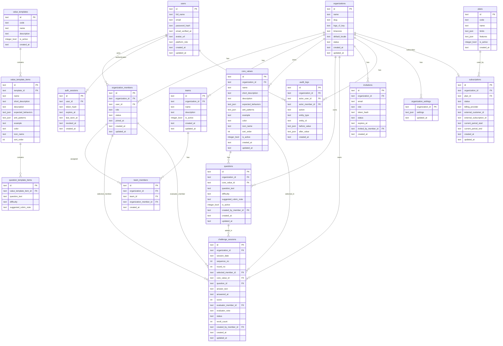

# 2. SaaS Data Model & ERD

## 2.1 Multi-Tenant Data Rules

All tenant-owned tables must include:

```text
organization_id text not null
```

Tenant-owned tables:

- organization_members
- teams
- team_members
- core_values
- questions
- challenge_sessions
- audit_logs
- organization_settings
- invitations

Global/platform tables:

- users
- organizations
- plans
- subscriptions
- value_templates
- value_template_items
- question_template_items

Notes:

- Users and organizations are many-to-many through `organization_members`.
- Each organization may have only one active owner row in `organization_members`.

## 2.2 Mermaid ERD



---
